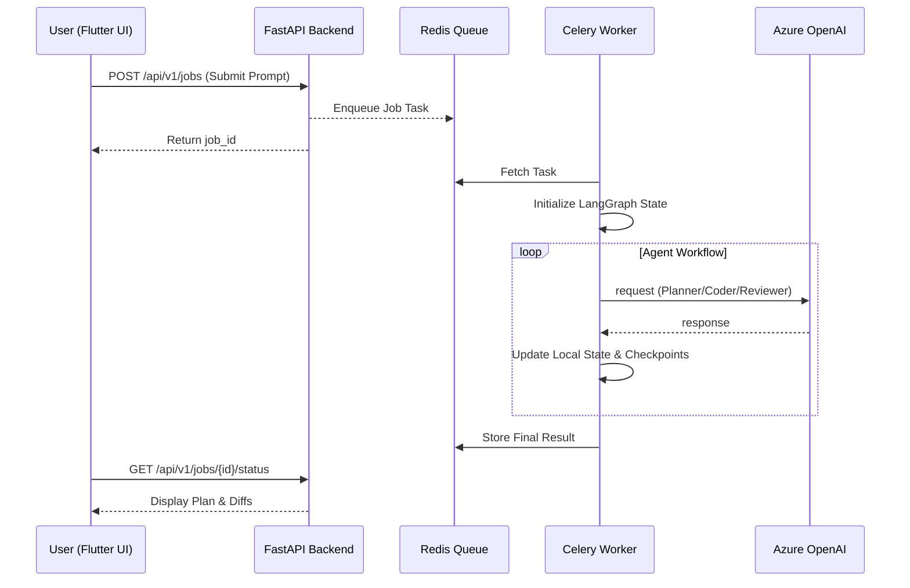

#Dev-Agent Product: Walkthrough

This document provides a comprehensive overview of the implementation, current status, and operational workflow of the **Greater God Agent** project.

## 🚀 Project Overview
The objective was to build a production-ready, autonomous AI coding agent system ("Greater God Mode") that improves upon legacy implementations by adding structured planning, async execution, and rich observability.

## 🛠 Progress Summary

### 1. Foundation & API
- **FastAPI Core**: Implemented a robust REST API for job management and health monitoring.
- **Security**: Integrated API Key authentication, rate limiting, and cost-budget management.
- **Environment**: Integrated `.devcontainer` and `.env` configuration for Azure OpenAI (SSIB Analysis model).

### 2. Intelligent Agent Workflow
- **LangGraph**: Designed a multi-step agentic workflow:
  - `Planner`: Breaks down requests into steps.
  - `Coder`: Generates diffs based on the plan.
  - `Tester`: Validates changes (mocked).
  - `Reviewer`: Final audit for security and quality.
- **Persistence**: Implemented `AsyncSqliteSaver` for checkpointing agent state across restarts.
- **Connectivity**: Implemented `CodexConnector` that wraps the `codex` CLI with a direct Azure OpenAI API fallback (using `requests`).

### 3. Async Infrastructure
- **Celery + Redis**: Decoupled long-running agent tasks from the API.
- **Job Lifecycle**: Implemented submission, cancellation, and real-time status tracking.
- **Dockerized Stack**: Provided `docker-compose.yml` orchestrating Redis, API, and Worker.

### 4. Product Experience
- **Flutter Dashboard**: Built a modern UI to monitor agent progress, visualize plans, and review code diffs in real-time.

---

## 🔄 System Workflow

---

## 🚩 Current Issue: Connectivity

While the **End-to-End flow** (API -> Worker -> Agent Logic) is fully verified, there is a blocking network issue:

> [!WARNING]
> **DNS Resolution Failure**
> The configured Azure endpoint `admrg-mgq7g66s-eastus2.cognitiveservices.azure.com` currently fails to resolve in this environment (`getaddrinfo failed`).
> - **Cause**: Likely a typo in the endpoint or a requirement for a specific VPN connection.
> - **Action Taken**: Corrected the URL construction logic in `wrapper.py` to strip incorrect `/v1` suffixes and implemented a direct API fallback to bypass the missing `codex` CLI.

## 🔍 Legacy Agent Comparison (`dev-agent`)
Based on the analysis of `@[dev-agent]`:
- **Parity**: Both systems use a `codex` CLI wrapper.
- **Key Difference**: `dev-agent` retrieves keys via `gopass`, while the new product uses centralized `.env` management.
- **Observation**: `dev-agent` does not explicitly set an endpoint in its shell scripts, implying it relies on a built-in default or global system config that is not currently shared with the new product environment.

## 🏁 Next Steps
1. **Connectivity**: Verify the Azure Endpoint and ensure the environment has network access.
2. **Execution**: Install the `codex` CLI if specialized local processing (git/context) is required beyond direct API calls.
3. **Merging**: Deepen the Knowledge Graph integration using the provided Tree-Sitter components.
